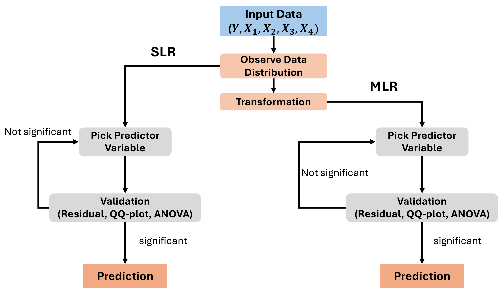
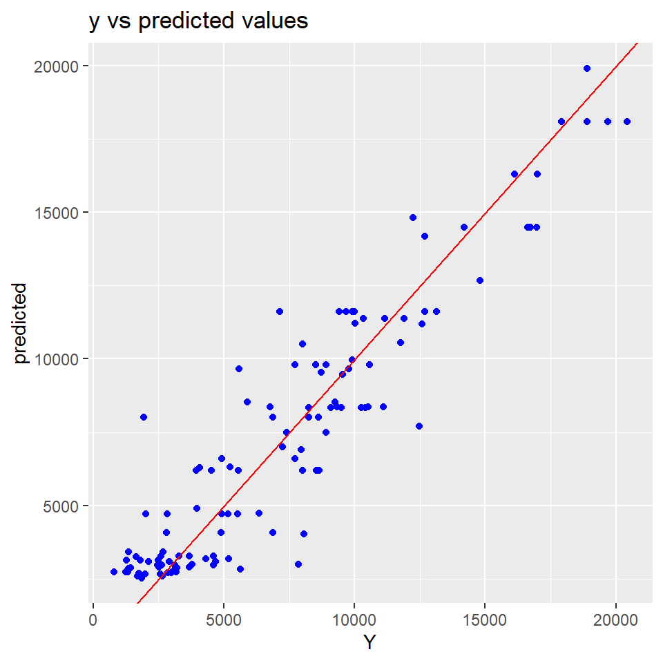
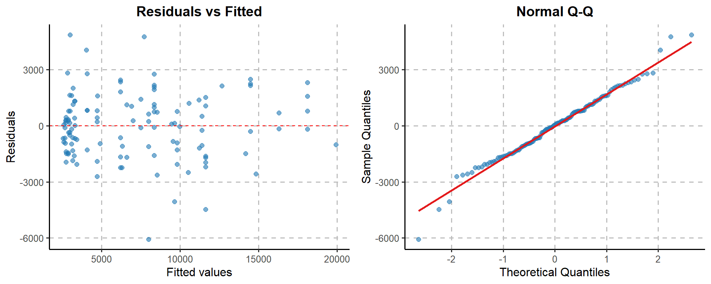

# MH3510 Project

[Main Page](https://pufanyi.github.io/MH3510-Project/) / [Report](https://pufanyi.github.io/MH3510-Project/MH3510_Project.pdf) / [Code (html)](https://pufanyi.github.io/MH3510-Project/DataAnalysis) / [Code (pdf)](https://pufanyi.github.io/MH3510-Project/DataAnalysis.pdf)

In this study, we investigate factors affecting Annual Average Daily Traffic (AADT) on road section, using a dataset comprising five variables. We demonstrate our overall pipeline in the figure below. After inputting our data, we first observe its distribution. To address the skewness in some of the data, we applied transformations to the data.

After that, we conduct Single Linear Regression (SLR) analysis. We analyze and explain the influence of each variable on the response variable in detail through this approach. In parallel, we also perform Multiple Linear Regression (MLR) analysis to get the more precise model. For variables found to be significant, we proceed to use them for prediction.

Our final model can be demonstrates below.

And the residual plot of our model is shown below.

